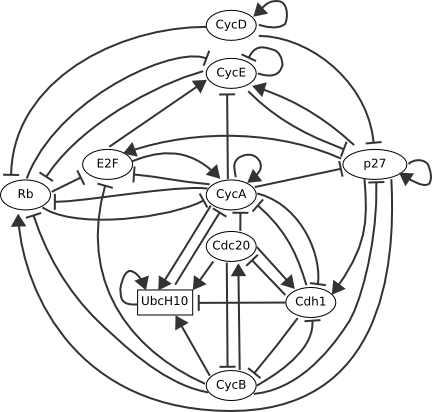
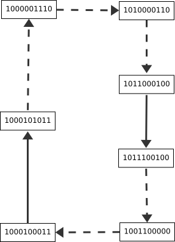
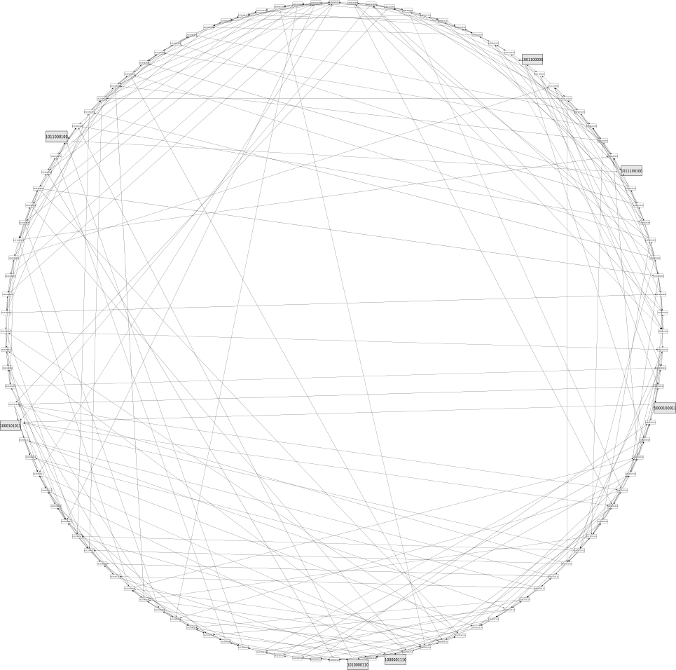
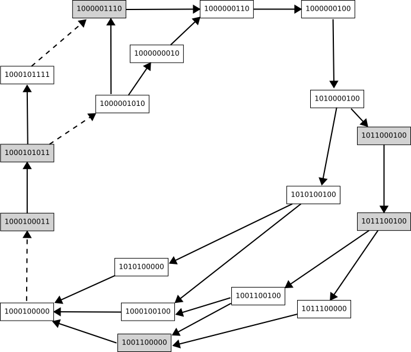

On the basis of a previous modelling study by Novak and Tyson , we have
recently proposed a generic Boolean model of the core network controlling the
restriction point of the mammalian cell cycle.

For proper logical parameter values, the simulation of this Boolean model
leads to dynamical behaviours (sequences of activations and inactivations of
key regulatory products) in qualitative agreement with current experimental
data.

However, as kinetic details are still lacking, many different (in)activation
pathways are compatible with existing data, including fully synchronous
transition pathways. To further evaluate these different possibilities, we
have analysed the asymptotical behaviour of this network under synchronous
versus asynchronous updating assumptions. Furthermore, we consider
intermediate updating strategies to improve the computation of asymptotical
properties depending on available kinetic data. This approach has been
implemented through user-defined priority classes in the logical modelling and
simulation software GINsim.

The Figure 1 presents the regulatory graph corresponding to our Boolean model
of the restriction point control for the mammalian cell cycle. In this graph,
each node represents the activity of a key regulatory element, whereas the
edges represent functional interactions between these elements. Blunt arrows
stand for inhibitory effects, whereas normal arrows stand for activations.

  
Figure 1: Regulatory graph

Depending on CycD activity at the initial state, our model can lead to two
different asymptotical behaviour:

To illustrate the impact of the updating assumption, we present here the
cyclic attractors (terminal, maximal, strongly connected components)
corresponding to three different updating assumptions:

   

Figure 2: attractors, depending on the updating policy (Node order in the
state labelling: CycD Rb E2F CycE CycA p27Kip1 Cdc20 Cdh1 UbcH10 CycB)

