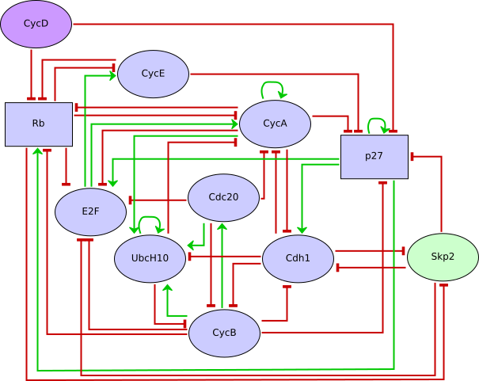

This model is an extension of the seminal model of the G1/S restriction point
control of mammalian cell cycle, published by Fauré et al .
We used model-checking and computing tree logics (CTL) to progressively refine
Fauré's model in order to fit recent experimental observations. The resulting
model accounts for the sequential activation of cyclins, the role of Skp2, and
emphasizes a multifunctional role for the cell cycle inhibitor Rb.
We provide GINsim and SBML versions of the original multivalued model as well
as of a Boolean translation.

Furthermore, we provide a script containing the main NuSMV queries used in the
article describing the methodology and the resulting revised model.

